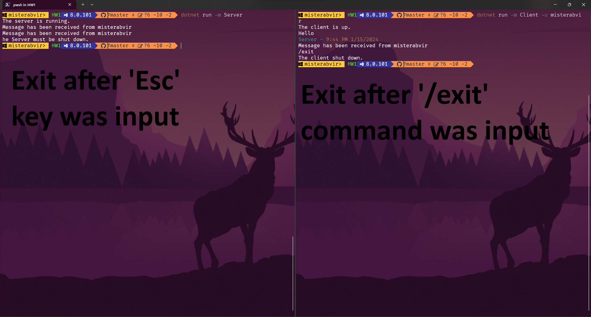
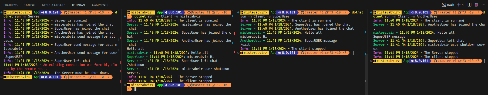
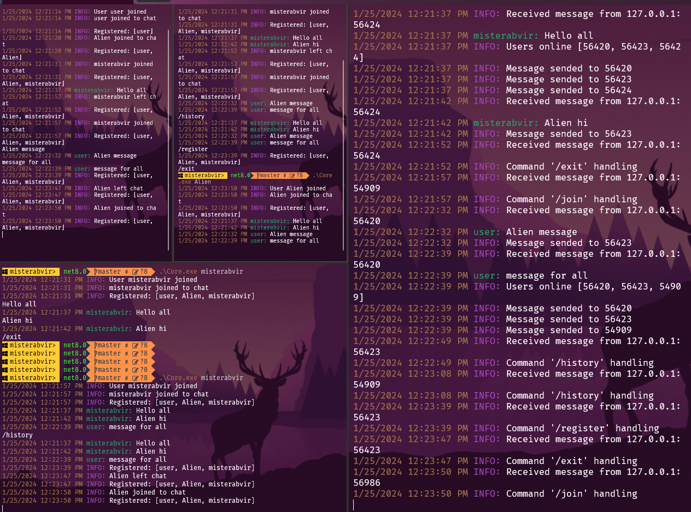

# Урок 1. Работа с сетью: чтение и запись данных в сеть. Клиентские и серверные приложения

# Урок 2. Синхронизации: многопоточность, создание и завершение потоков

Добавьте возможность ввести слово Exit в чате клиента, чтобы можно было завершить его работу.

# Урок 3. PLINQ и асинхронность: как работает, области применения
Добавьте использование Cancellationtoken в код сервера, чтобы можно было правильно останавливать работу сервера.

# Урок 4. GOF: паттерны проектирования в .Net разработке
Структурируйте код клиента и сервера чата, используя знания о шаблонах.

# Урок 5. Базы данных: Entity framework, code first/db first
Реализуйте тип сообщений List, при котором клиент будет получать все непрочитанные сообщения с сервера.

>ps реализовано с помощью SQLite

