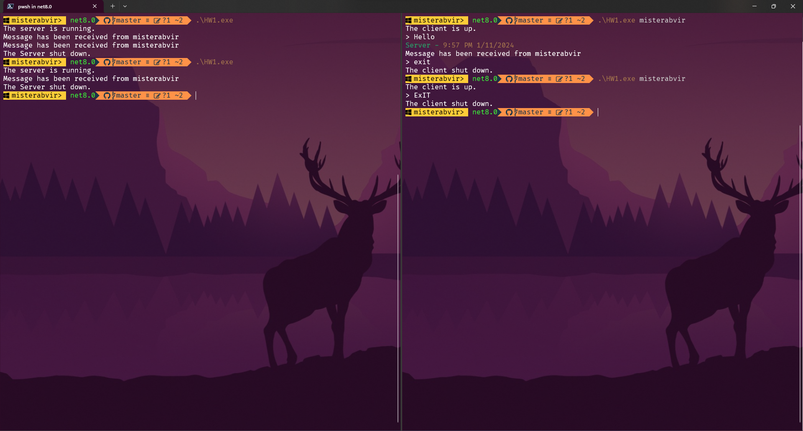
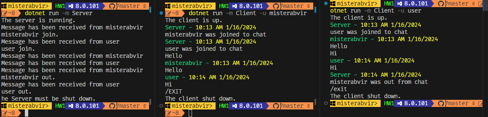

# Урок 1. Работа с сетью: чтение и запись данных в сеть. Клиентские и серверные приложения

# Урок 2. Синхронизации: многопоточность, создание и завершение потоков

Добавьте возможность ввести слово Exit в чате клиента, чтобы можно было завершить его работу.

# Урок 3. PLINQ и асинхронность: как работает, области применения
Добавьте использование Cancellationtoken в код сервера, чтобы можно было правильно останавливать работу сервера.

